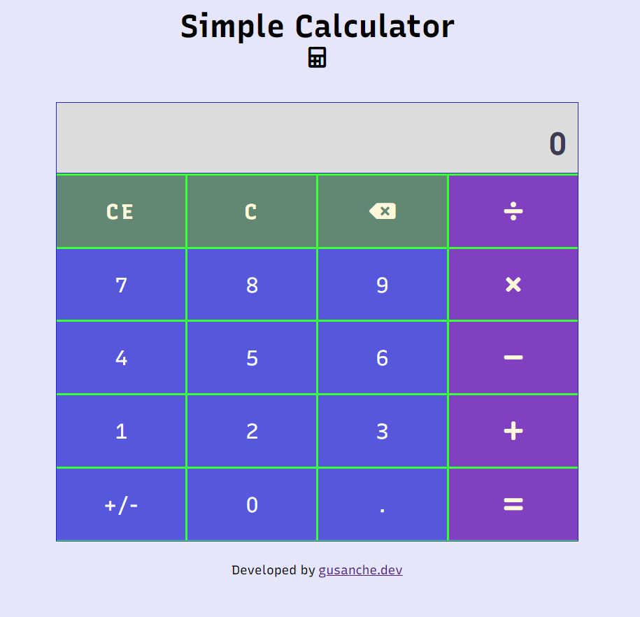

# Javascript Project - Simple Calculator

This is a solution to Simple Calculator using HTML- CSS and vanilla Javascript.

## Table of contents

- [Overview](#overview)
  - [The challenge](#the-challenge)
  - [Screenshot](#screenshot)
  - [Links](#links)
- [My process](#my-process)
  - [Built with](#built-with)
  - [What I learned](#what-i-learned)
  - [Continued development](#continued-development)
  - [Useful resources](#useful-resources)
- [Author](#author)
- [Acknowledgments](#acknowledgments)

## Overview

### The challenge

- To apply basics of Javscript like operators, basic logic structures and formatting.

### Screenshot



### Links

- Solution URL: [@GitHub](https://github.com/gustavosanchezgalarza/simple-calculator)
- Live Site URL: [@Vercel live site URL here](http://simple-calculator-gusanchedev.vercel.app/)

## My process

### Built with

- Semantic HTML5 markup
- CSS custom properties
- Flexbox
- CSS Grid
- Mobile-first workflow

### What I learned

Use this section to recap over some of your major learnings while working through this project. Writing these out and providing code samples of areas you want to highlight is a great way to reinforce your own knowledge.

To see how you can add code snippets, see below:

How to format numbers to en-US for calculator display with commas (,) and period (.) for decimals.
```Javascript
function formatResult(result) {
  return new Intl.NumberFormat("en-US", {
    maximumSignificantDigits: 15,
  }).format(result);
}
```

How to add event listeners to elements of DOM.
```Javascript
function captureOperand() {
  let htmlCollection = document.getElementsByClassName("digit");
  let keyDigits = [...htmlCollection];
  console.log(keyDigits);
  keyDigits.forEach((element) => {
    element.addEventListener("click", (event) => {
      operand += event.target.innerText;
      console.log("Operando", parseFloat(operand));
      displayResult(formatResult(operand));
      if (!currentOperator) {
        stringA = operand;
        console.log(
          `stringA: ${stringA}, stringB: ${stringB}, CurrentOperator: ${currentOperator}, previousOperator: ${previousOperator}, Operando: ${operand}`
        );
      } else {
        stringB = operand;
        console.log(
          `stringA: ${stringA}, stringB: ${stringB}, CurrentOperator: ${currentOperator}, previousOperator: ${previousOperator}, Operando: ${operand}`
        );
      }
    });
  });
}
```


If you want more help with writing markdown, we'd recommend checking out [The Markdown Guide](https://www.markdownguide.org/) to learn more.

### Continued development

This is the first of a series of Javscript projects to gain better understanding of Javscript language in Frontend and Backend.

### Useful resources

- [A Complete Guide to Flexbox](https://css-tricks.com/snippets/css/a-guide-to-flexbox/)
- [A Complete Guide to Grid](https://css-tricks.com/snippets/css/complete-guide-grid/)
- [Media Queries for Standard Devices](https://css-tricks.com/snippets/css/media-queries-for-standard-devices/)
- [International Number Format in Javascript](https://developer.mozilla.org/en-US/docs/Web/JavaScript/Reference/Global_Objects/Intl/NumberFormat)

## Author

- Website - [gusande.dev](https://www.gusanche.dev)
- GitHub - [@gustavosanchezgalarza](https://github.com/gustavosanchezgalarza)
- Twitter - [@gusanchedev](https://twitter.com/gusanchedev)

## Acknowledgments

MDN  is awesome 😎😎!!!
I strongly recommend [Javascript documentation](https://developer.mozilla.org/en-US/docs/Web/JavaScript)